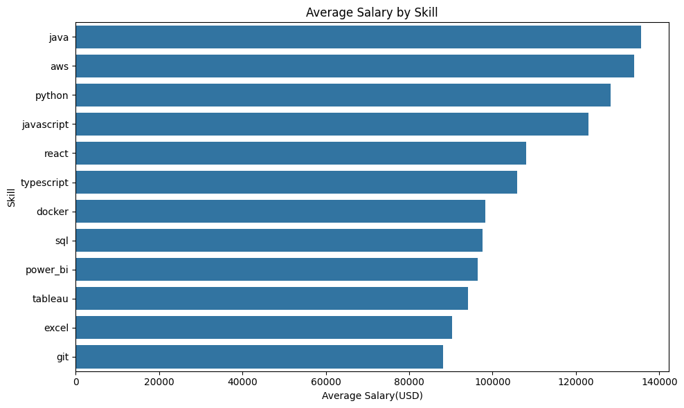
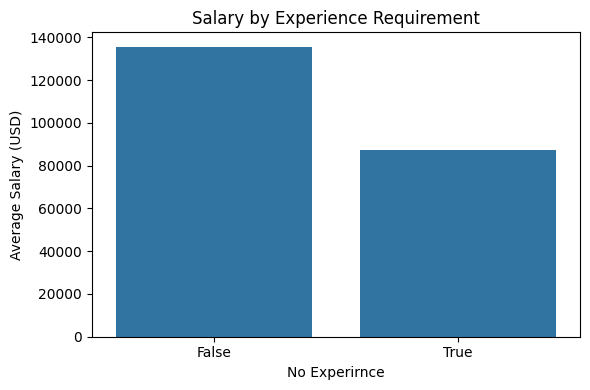
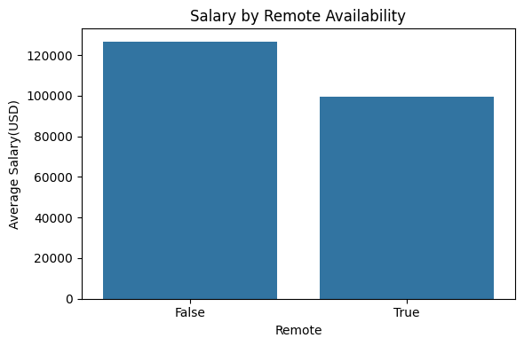

#エンジニア職の年収とスキルの関係分析

Adzuna APIから取得したUS求人データを用いて、
スキル・経験条件・リモート勤務と年収の関係を分析した。

## 1.背景

エンジニア職ではスキルや働き方によって年収に差があると考えた。

本分析では求人データを用いて、スキル・経験・リモート勤務と年収の関係を分析した。
また、本分析は求人データを用いた相関分析であり、因果関係を示すものではない。

## 2.仮説

仮説1:スキルと年収の関係
スキルの有無・組み合わせで収入に差が出る

仮説2:経験と年収の関係
未経験OKの求人は経験者求人より年収が低い

仮説3:働き方と年収の関係
リモート可の求人は年収が高い傾向がある

## 3.データ

- Adzuna API
- US job posting
- 約1200件

## 4.使用技術

- Python
- pandas
- requests
- matplotlib
- statsmodels
- seaborn
- python-dotenv
- Adzuna API

## 5.分析手法

- 求人データ取得
- 欠損値除去
- 重複除去
- 給与下限によるノイズ除去
- 正規表現によるスキル抽出
- DataFrame化、groupby分析
- 回帰分析

## 6.ディレクトリ構成

project/
├── data/
│   └── cleaned_jobs.csv
├── graphs/
│   ├── no_experience_salary.png
│   ├── remote_salary.png
│   └── skill_salary.png
├── analyze.py
├── collect_jobs.py
├── README.md
└── requirements.txt

## 7.実行方法

```bash
pip install -r requirements.txt
python analyze.py
```

## 8.結果・考察

## 仮説1: スキルと年収の関係

### 結果



スキル別平均年収
・Java, AWS, Pythonを含む求人は平均年収が高い傾向がみられた。
・一方でReact、TypeScriptは平均年収が低めだった。

職種別分析
・Python/Javaは複数職種で高い傾向がある。

回帰分析
職種やスキルを同時に考慮するため、OLSによる重回帰分析を実施した。

主な結果:

・Python: 約+12k USD（p=0.03）
・Remote: 約-23k USD
・No Experience: 約-20k USD

Pythonスキルは他条件を固定した場合でも正の影響が見られた一方、リモート可・未経験OKは負の関係が見られた。


### 考察

Java・AWS・Pythonは比較的高年収の求人で多く見られた。
特にPythonは回帰分析でも正の係数を示しており、職種や働き方を考慮しても一定の正の関係が確認された。

一方でExcel、Tableau、Power BI、SQLなどデータ分析系スキルを含む求人は平均年収が低めだった。
これはData AnalystやJunior Data Analystなど比較的年収帯の低い職種に多く含まれていたためと考えられる。

SQLは単純比較では平均年収が低めだった。
これはData Analyst系職種への偏りが影響している可能性がある。

また、ReactやTypeScriptも単純比較では低めだったが、Frontend系やJunior系求人の影響を受けている可能性がある。

DockerやGitなど一部スキルは件数が少なく、解釈には注意が必要である。

## 仮説2: 経験と年収の差

### 結果



・まず未経験OKの求人数388(約31%)、経験者向けの求人数861(約69%)だった。
・未経験OKの求人の平均年収は約87k USD、経験者向けの求人は約136k USD。
・未経験OKの求人は全体的に低年収の傾向が確認できた。

### 考察

未経験OK求人は平均年収が低い傾向が確認された。
これは、未経験歓迎求人にはJunior DeveloperやGraduate Engineerなど初級ポジションが多く含まれていたためと考えられる。

また、回帰分析でもNo Experienceは負の係数を示しており、他条件を考慮しても年収との負の関係が見られた。

## 仮説3: 働き方と年収の関係

### 結果



・単純比較ではリモート求人の平均年収は低かった。
ただし職種構成や経験条件の影響を受けている可能性がある。

・リモート可求人は約99k USD、非リモート求人は約127k USD。
・今回のデータではリモート可の求人の方が平均年収は低かった。

### 考察

単純比較ではリモート可求人の平均年収は低かった。
ただし、リモート可求人にはJunior系やData Analyst系職種が多く含まれている可能性があり、職種構成や経験条件の影響を受けていると考えられる。

一方で、回帰分析でもRemoteは負の係数を示しており、今回のデータではリモート可求人と年収の間に負の関係が確認された。

## 9.限界

- 求人票ベースの分析
- 推定給与を含む(推定給与を除外するとサンプルが極端に減ったため(後述))。
- スキル抽出は単純な文字列判定であり、文脈は考慮していない。
- 因果関係は示していない。

## 10.今後の改善

- NLPを用いた抽出改善の余地がある
- 求人タイトルの詳細分類
- 地域差を考慮した分析
- 推定給与除外後の分析改善
- 箱ひげ図
- ヒストグラム
- 多重共線性を考慮した特徴量設計
- 対数変換による分布改善
- より高度な回帰モデルの検討

# ==================================================================================================
salary_is_predictedについて、salary_is_predictedを除外すると1350->1287(重複除外後)->92になった。


